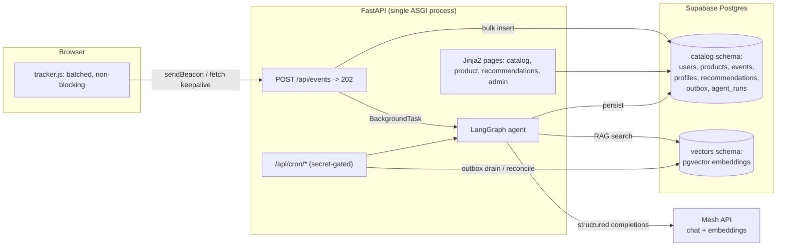

# SmartReco — a Behavioral AI Recommendation Agent

SmartReco is an online course marketplace that watches how each user actually behaves — what they
view, search for, click, and linger on — and runs a structured [LangGraph](https://github.com/langchain-ai/langgraph)
agent that reasons over that behavior, retrieves the most relevant courses from a vector store, and
writes a short, persuasive, catalog-grounded recommendation. Recommendations refresh automatically
as behavior shifts, and everything runs through [Mesh API](https://meshapi.ai) as the LLM/embedding
gateway.

Full design rationale lives in [`ARCHITECTURE.md`](./ARCHITECTURE.md); this README is the practical
"what did you build and how do I run it" companion.

## Contents

- [What was built](#what-was-built)
- [Bonus features implemented](#bonus-features-implemented)
- [Architecture at a glance](#architecture-at-a-glance)
- [Quick start (Docker Compose — recommended)](#quick-start-docker-compose--recommended)
- [Local development without Docker](#local-development-without-docker)
- [Deploying to Vercel + Supabase](#deploying-to-vercel--supabase)
- [The trigger policy — how AI-call frugality is enforced](#the-trigger-policy--how-ai-call-frugality-is-enforced)
- [Testing](#testing)
- [Repository layout](#repository-layout)
- [Deviations from ARCHITECTURE.md](#deviations-from-architecturemd)
- [Security notes](#security-notes)

## What was built

**1. The platform.** Email/password auth (argon2id password hashing, signed `itsdangerous` session
cookies) with two roles. Users browse the catalog and see recommendations; admins manage products
and have an observability page over agent runs. Server-rendered with Jinja2 (`smartreco_agent/src/web/templates/`);
FastAPI serves both the HTML and the JSON ingest API from one ASGI process.

**2. Product management with dual-write.** Admin create/edit/delete writes the product row and a
`catalog.vector_outbox` row in one Postgres transaction (the [transactional outbox
pattern](https://microservices.io/patterns/data/transactional-outbox.html)), so a crash between the
two writes is structurally impossible. A drainer embeds pending rows into `vectors.product_embeddings`
(pgvector) immediately as a background task, and an hourly reconcile job hash-diffs the two stores
directly and repairs any drift — so "kept in sync" is demonstrable, not just asserted (see
[`tests/test_reconcile.py`](./tests/test_reconcile.py)).

**3. Behavioral event tracking.** [`static/tracker.js`](./smartreco_agent/src/web/static/tracker.js)
is a dependency-free client that captures `product_view`, `search`, `click`, `scroll` (throttled,
25% depth milestones), and `dwell` (via the Page Visibility API) events. Events buffer client-side
and flush on whichever comes first: 10 events, a 5s timer, or the page hiding/unloading — using
`navigator.sendBeacon` on unload and `fetch(..., {keepalive:true})` otherwise, so tracking never
blocks rendering or a page transition. The server does one multi-row `INSERT ... ON CONFLICT DO
NOTHING` and returns `202` before any interest-model work happens
([`routes/events.py`](./smartreco_agent/src/routes/events.py)).

**4. The agentic recommendation engine.** A full [LangGraph](./smartreco_agent/src/agent/graph.py)
state machine: `load_signals → analyze_intent → retrieve → grade → refine (≤1 loop) → rerank →
generate_and_verify → persist`. Retrieval is real RAG over pgvector with metadata pre-filtering and
MMR de-duplication; a heuristic grader can send one retry through query refinement if results look
thin; reranking fuses similarity, category match, recency, and popularity; generation is grounded —
every cited `product_id` is checked against the retrieved candidate set, with one retry and then a
hard fail-closed if the model still hallucinates (never persisted; see
[`tests/test_grounding_validator.py`](./tests/test_grounding_validator.py)).

**5. Efficiency & production thinking.** A three-tier trigger policy
([`tracking/gate.py`](./smartreco_agent/src/tracking/gate.py)) decides when the (expensive) agent is
allowed to run at all — see [below](#the-trigger-policy--how-ai-call-frugality-is-enforced). Every
agent run is logged to `catalog.agent_runs` (cache hits, refine loops, token counts, errors) and
visible on `/admin/observability`, which is the evidence trail for the frugality claim.

## Bonus features implemented

| Bonus | Status |
|---|---|
| ⭐ Structured agent framework (LangGraph) | **Implemented** — 8-node graph, see `agent/graph.py` and `agent/nodes/` |
| ⭐ Scheduled proactive delivery | **Implemented** — `pg_cron` + `pg_net` drive `/api/cron/digest` → `/api/cron/digest-worker`, which runs the agent per active user and emails a recap via [Resend](https://resend.com) |
| ⭐ Observability (LangSmith) | **Not implemented** — descoped by design; a lighter-weight `catalog.agent_runs` table + `/admin/observability` page was built instead, since it's what the trigger-policy test evidence actually needs. See [Deviations](#deviations-from-architecturemd). |
| ⭐ Retrieval polish | **Implemented** — multi-query retrieval, metadata pre-filtering, MMR diversity, and score-fusion reranking (similarity + category + recency + popularity) |

## Architecture at a glance



Product writes go through the same catalog → outbox → drainer path from `routes/admin.py`, keeping
`catalog.products` and `vectors.product_embeddings` in sync without a cross-schema foreign key.

## Quick start (Docker Compose — recommended)

The only credential you need to supply is a Mesh API key.

```bash
git clone <this-repo>
cd smartreco-agent
cp .env.example .env        # then edit .env and set MESH_API_KEY=rsk_...

make up                     # builds + starts Postgres/pgvector and the app, waits for /health
make seed                   # 39 courses across 8 overlapping categories, an admin + a demo user
make demo                   # replays a behavioral trace and prints the recommendation shift
```

Then open **http://localhost:8000**:

- Demo user: `demo@smartreco.dev` / `demopass123`
- Admin user: `admin@smartreco.dev` / `adminpass123` → `/admin/products`, `/admin/observability`

`make down` stops everything; `make logs` tails the app container.

### Cron endpoints (no `pg_cron` locally)

The `pgvector/pgvector` image doesn't ship `pg_cron`, so scheduling isn't exercised by `docker
compose up` — the cron endpoints are plain, secret-gated HTTP routes, driven by hand instead. This
runs exactly the same code `pg_cron` invokes in production; only the trigger differs:

```bash
make cron-outbox       # drain any pending outbox rows
make cron-reconcile    # hash-diff catalog vs. vector store, repair drift
make cron-digest       # enqueue users active "this morning" for a digest
make cron-digest-worker  # process the digest queue: run the agent, send email
```

## Local development without Docker

```bash
make install                 # uv venv + editable install + pre-commit hooks
make db                       # just the Postgres/pgvector container, port 5432
make local                    # uvicorn --reload against localhost:5432
```

`make local` expects `.env` to exist (created from `.env.example` automatically) and overrides
`DATABASE_URL` to point at `localhost` instead of the `db` service name Compose uses internally.

## Deploying to Vercel + Supabase

1. Create a [Supabase](https://supabase.com) project, then run `migrations/0001_catalog.sql` and
   `migrations/0002_vectors.sql` against it (SQL editor or `psql`) to create the `catalog` and
   `vectors` schemas and enable `pgvector`.
2. In Supabase, schedule the cron jobs with `pg_cron` + `pg_net` (Appendix B.5 of
   `ARCHITECTURE.md`) to call `/api/cron/outbox`, `/api/cron/reconcile`, `/api/cron/digest`, and
   `/api/cron/digest-worker` on your deployed URL.
3. `vercel link`, then set the environment variables from `.env.example` in the Vercel project
   (use the Supabase **transaction pooler** connection string on port `6543` for `DATABASE_URL`,
   and set `DB_DISABLE_PREPARE=true` — the pooler does not support prepared statements).
4. `git push` — Vercel builds the FastAPI app as serverless functions per `vercel.json`, routing
   every request through `api/index.py`, which just re-exports the same `smartreco_agent.src.api:app`
   that Docker Compose runs. There is no separate build or deploy path to keep in sync.

## The trigger policy — how AI-call frugality is enforced

The brief explicitly judges this, so it's the one part of the system with dedicated, quantified
test coverage rather than a design-doc claim. Three tiers ([`ARCHITECTURE.md` §8](./ARCHITECTURE.md)):

- **Tier 0 (every event, free):** decayed interest weights + an interest vector, maintained in pure
  SQL/numpy in [`tracking/profile.py`](./smartreco_agent/src/tracking/profile.py) — no LLM call.
- **Tier 1 (the gate, free):** [`tracking/gate.py`](./smartreco_agent/src/tracking/gate.py) evaluates
  a 10-minute cooldown (absolute — not bypassable even by a manual "Refresh now" click), a
  profile-hash-unchanged short-circuit, an event-count threshold, cosine drift against the
  vector used for the last generation, and a top-category shift.
- **Tier 2 (the agent, expensive):** only runs when Tier 1 returns a trigger reason.

[`tests/test_gate_frugality.py`](./tests/test_gate_frugality.py) replays 200 synthetic events across
~66 minutes of simulated browsing (including a real interest drift and a category pivot) and asserts
the gate fires **4–8 times** — not once, not on every batch. `scripts/simulate_user.py` demonstrates
the same claim end-to-end against Mesh: it prints the total number of Mesh API calls made across two
full behavioral phases (~70 tracked events) alongside the recommendation shift.

## Testing

```bash
make test          # pytest --cov=smartreco_agent --cov-report=term-missing
make lint          # ruff check + ruff format --check
```

No live Postgres is required — every test monkeypatches the narrow `catalog` / `outbox` /
`VectorStore` / Mesh-client seams the code under test calls, rather than standing up a database, so
the suite runs in under two seconds in CI. The six tests carrying the most evidentiary weight
(mirroring `ARCHITECTURE.md` §15):

| Test | Claim it proves |
|---|---|
| `test_gate_frugality.py::test_trigger_policy_is_frugal` | 200 events → 4–8 agent runs, not 200 |
| `test_ingest_no_llm.py` | Mesh client is never constructed on the ingest response path |
| `test_reconcile.py` | hash-diff reconciliation correctly classifies missing/stale/orphaned vectors |
| `test_grounding_validator.py` | a hallucinated `product_id` is rejected after one retry, fails closed |
| `test_outbox_skips_unchanged.py` | a price-only product edit triggers zero embedding calls |
| `test_profile_decay.py` | a 7-day-old interest ranks below a 1-hour-old one of equal weight |

## Repository layout

```
smartreco_agent/src/
  api.py, main.py          FastAPI app, middleware, lifespan; Uvicorn entrypoint
  settings.py               pydantic-settings config (Mesh, DB, session, cron, email)
  schema.py                 shared Pydantic request/response models
  auth/                     argon2 hashing, itsdangerous session cookies, role dependencies
  db/                       psycopg async pool, catalog queries, transactional outbox, hashing
  vectors/                  VectorStore protocol + pgvector implementation + Mesh embedder
  mesh/                     Mesh API client (chat completions, embeddings, capability check)
  tracking/                 decayed interest profile (profile.py) + trigger gate (gate.py)
  agent/                    LangGraph state, nodes, prompts, schemas, graph assembly
  cron/                     outbox drainer, reconcile, digest enqueue/worker, email
  routes/                   auth, web (SSR pages), events (ingest), admin, cron
  web/                      Jinja2 templates + static/ (tracker.js, styles.css)
scripts/
  seed_catalog.py            39 courses / 8 overlapping categories + admin/demo users
  simulate_user.py           the demo surface — replays a trace, prints the shift + call count
migrations/                  plain .sql, applied in order (also the Docker initdb scripts)
tests/                       6 evidentiary tests, no live DB required
api/index.py                 Vercel entrypoint (re-exports the same ASGI app)
vercel.json                  rewrites + includeFiles + maxDuration
Containerfile, compose.yaml  local dev / reviewer path only — Vercel does not use these
Makefile                     install, local, up/down, seed, demo, cron-*, test, lint
ARCHITECTURE.md              full design rationale
```

## Deviations from ARCHITECTURE.md

- **Package layout.** The document's illustrative tree uses a bare `app/` package; this repo keeps
  its existing `smartreco_agent/src/` layout (an explicit, pre-existing project convention) with the
  same internal module boundaries (`auth/`, `db/`, `vectors/`, `tracking/`, `agent/`, `cron/`,
  `routes/`, `web/`).
- **Observability bonus.** LangSmith/Langfuse tracing was explicitly descoped. `catalog.agent_runs`
  (trigger reason, cache hits, refine loops, token counts, per-node timings, errors) is still
  populated on every run and exposed at `/admin/observability`, since the trigger-policy frugality
  claim needs that evidence regardless of whether a full tracing dashboard exists.
- **Catalog size.** 39 seeded courses across 8 categories rather than 60 — chosen for deliberate
  semantic overlap between categories (e.g. "Agentic AI" and "LLM Engineering" share vocabulary),
  which matters more for a meaningful retrieval/rerank demo than raw count.

## Security notes

- Passwords hashed with argon2id (`argon2-cffi`); never logged.
- Sessions are signed, `HttpOnly`, `SameSite=Lax` cookies via `itsdangerous` (`Secure` when served
  over HTTPS). No JWT — there's no cross-service boundary in this project to justify one.
- Admin routes are gated by a server-side role dependency (`require_admin`) checked on every
  request; the nav link being hidden for non-admins is a convenience, not the access control.
- Cron endpoints require a secret compared in constant time (`hmac.compare_digest`).
- `EventBatch` is capped at 50 events and strictly validated by Pydantic; a hostile client cannot
  unboundedly inflate its own interest model.
- The Mesh API key is never rendered, logged, or returned in an error body.
